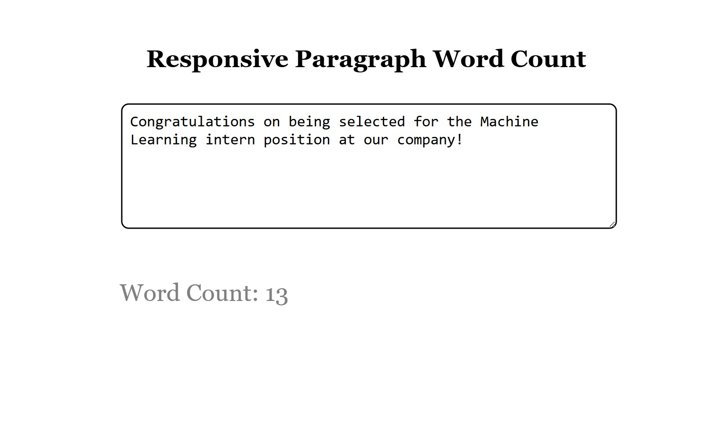

# 📝 Responsive Paragraph Word Counter

A simple and responsive React application that counts the number of words and characters in a given paragraph. Built as part of a React learning task.

🔗 **Live Demo:** [https://task-1-react.vercel.app/](https://task-1-react.vercel.app/)

---

## 🚀 Features

- Realtime word and character counter
- Responsive design for all screen sizes
- Clear input button
- React functional components and hooks

---

## 📸 Screenshots

### 🏠 Home Page

This is the initial view of the app when loaded.



---

### ✍️ Word Count in Action

This shows the word and character count functionality after entering a sample paragraph.


---

## ⚙️ Tech Stack

- ReactJS
- HTML5 & CSS3
- JavaScript (ES6)

---

## 📦 Installation & Setup

1. **Clone the repository:**
   ```bash
   git clone https://github.com/yaswantharao05/Responsive-Paragraph-Word-Counter.git
   cd responsive-word-counter
